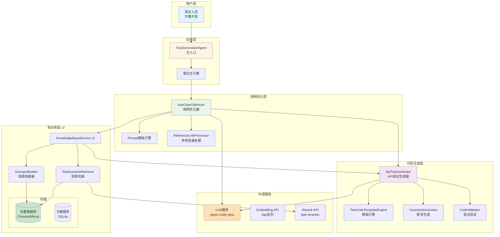
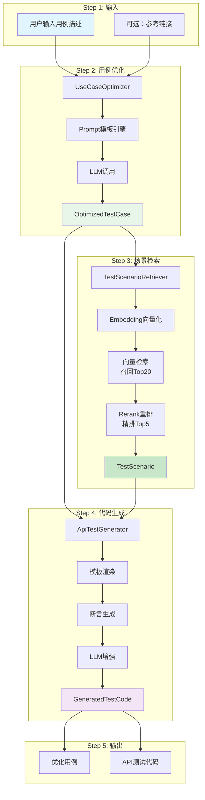
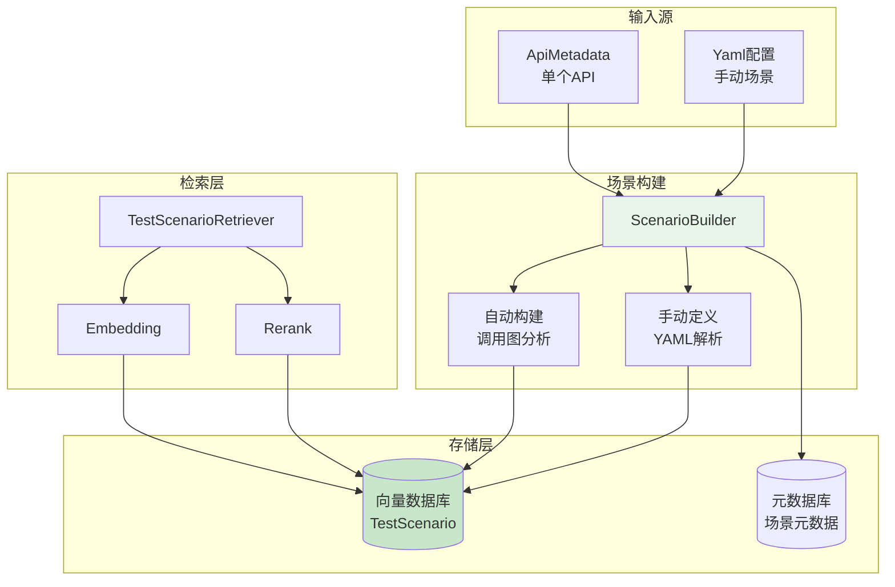
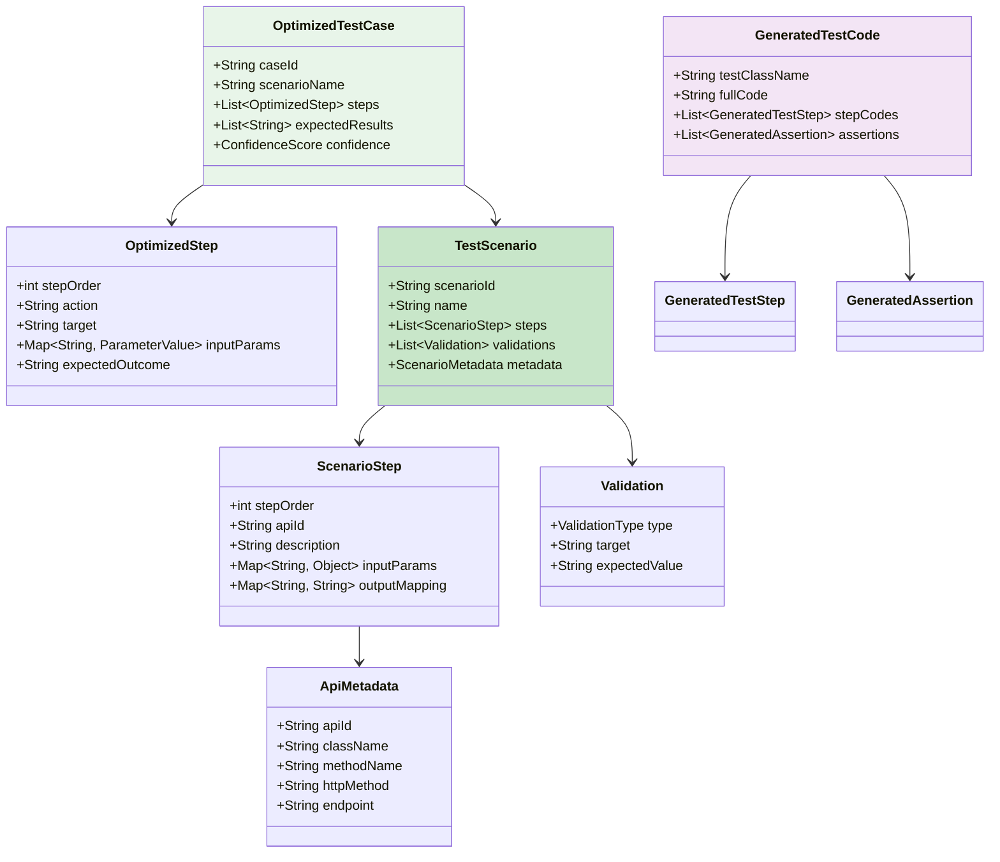
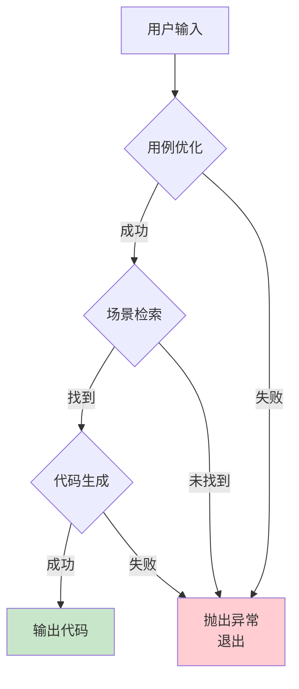
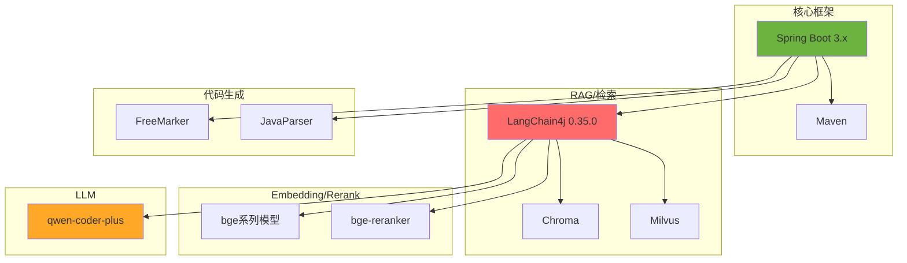
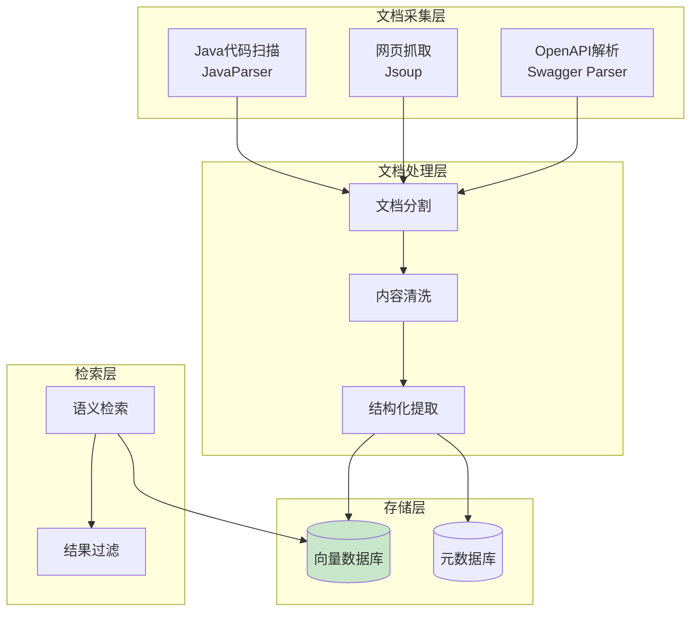

# 系统架构图

> 文档定位：本文件描述“目标架构（P10规格）”，用于对齐方向与模块边界；不等价于当前已实现能力。  
> 运行与配置基线以 [CONFIG_GUIDE.md](/root/ascend_agent/docs/CONFIG_GUIDE.md) 为准；本文件仅负责说明架构目标与当前实现状态。

## 0. 当前实现状态与后续治理（截至 2026-03-20）

### 0.1 实现状态（收口口径）

状态标签：
- Implemented：可在仓库中定位实现，且具备可用闭环或至少具备自洽的最小链路
- Partial：存在实现但关键契约/闭环/幂等性不成立，或存在明确的 P0/P1 风险
- Stub：有接口/骨架/文档承诺，但默认路径不可用或关键依赖未装配
- Draft：仅设计与占位，代码中尚未出现

实现映射（仅列本文件图中核心构件）：

| 模块 | 目标（图中定位） | 当前状态 | 备注（来自评审结论） |
|---|---|---|---|
| KnowledgeBaseService v1 | 索引/检索基础设施 | Partial | 构建基线冲突、索引生命周期/幂等性与元数据 round-trip 不成立 |
| 知识库 v2（TestScenario/Builder/Retriever/Service） | 场景化检索 | Partial | YAML 加载器卡死风险；默认检索装配不稳定；索引更新与检索实体回源不闭环 |
| Spring Boot 接入层（Config/Controller） | 运行外壳/对外 API | Partial | 已具备预构建 JAR 运行外壳；服务可在 `8080` 暴露 `/actuator/health`，但不代表业务主链路已闭环 |
| Chroma 开发态向量存储 | 向量检索基础设施 | Implemented | Sprint-1 基线锁定为 Chroma `0.5.20`，脚本入口为 `scripts/install_chroma_0520.sh` / `scripts/start_chroma_22333.sh`，默认地址 `127.0.0.1:22333`，长期目录合同根为 `ASCEND_AGENT_HOME=./.ascend_agent/` |
| UseCaseOptimizer | 用例优化层 | Draft | 仅有文档与架构占位，当前仓库未实现 |
| ApiTestGenerator / CodeValidator 等 | 代码生成层 | Draft | 仅有文档与架构占位，当前仓库未实现 |
| 零交互引擎 / 主 Agent | 应用层主入口 | Draft | 仅有文档与架构占位，当前仓库未实现 |

### 0.2 当前基线/后续治理（收口说明）

当前基线结论：
- 本仓库当前主要是“知识库原型 + v2 骨架”，尚未形成架构图中的端到端零交互闭环。
- 当前 Java 基线已统一为 21；应用默认 `8080`，Chroma 开发态默认 `127.0.0.1:22333`。
- 长期默认目录合同已收口为 `ASCEND_AGENT_HOME=./.ascend_agent/`；`tools/chroma-venv-0520`、`chroma`、`db`、`logs`、`pids` 都应从该根目录派生，不再把 `/tmp` 视为长期默认路径。
- “服务能启动”只说明运行壳存在，不等价于图中所有模块都已实现。

后续治理约定：
- 任何新增能力必须先标注状态（Implemented/Partial/Stub/Draft），禁止把规划能力写成已完成。
- 若图与实现发生漂移：优先更新 [CONFIG_GUIDE.md](/root/ascend_agent/docs/CONFIG_GUIDE.md) 的运行基线与本节状态映射，再讨论是否扩展图中模块。

## 1. 整体架构（新版 - P10规格）



## 2. 核心流程（新版 - P10规格）



## 3. 知识库v2架构



## 4. 数据模型关系



## 5. 错误处理策略（零交互）



## 6. 技术栈



---

## 附录：原有知识库架构（v1）

> 以下为原有设计，保持兼容。

### A.1 知识库v1架构



### A.2 ApiMetadata结构

```java
public class ApiMetadata {
    private String apiId;              // 唯一标识
    private String className;          // 类名
    private String methodName;          // 方法名
    private String signature;          // 方法签名
    private String description;         // 描述文本
    private DocumentSourceType sourceType;
    private String sourceLocation;
    private List<Parameter> parameters;
    private String returnType;
    private List<String> exceptions;
    private String httpMethod;
    private String endpoint;
    private String requestBody;
    private String responseBody;
    private float[] vector;
}
```

### A.3 知识库v1服务接口

```java
public interface KnowledgeBaseService {
    IndexStats indexJavaProject(String projectPath);
    IndexStats indexExternalDocs(List<DocumentSource> sources);
    List<ApiMetadata> search(String query, int topK, SearchOptions options);
    void updateIndex(List<String> changedFiles);
}
```
