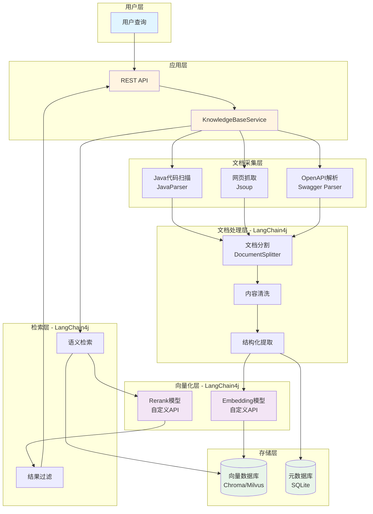
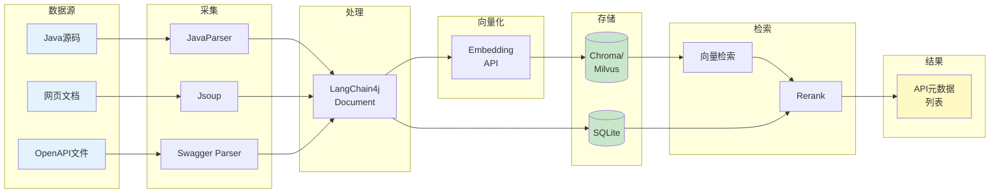
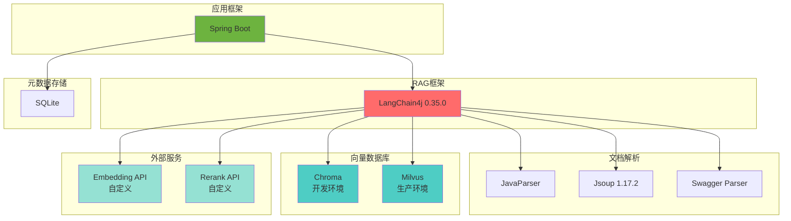
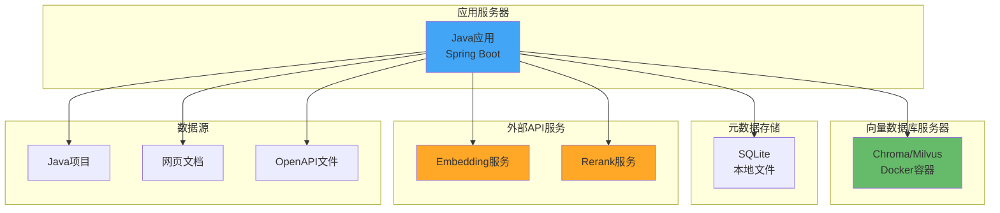
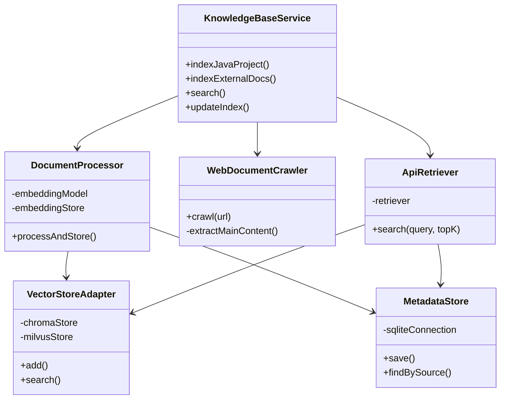

# 知识库模块架构图

## 1. 整体架构

```mermaid
graph TB
    subgraph "用户层"
        User[用户查询]
    end

    subgraph "应用层"
        API[REST API]
        Service[KnowledgeBaseService]
    end

    subgraph "文档采集层"
        JavaScanner[Java代码扫描<br/>JavaParser]
        WebCrawler[网页抓取<br/>Jsoup]
        OpenAPILoader[OpenAPI解析<br/>Swagger Parser]
    end

    subgraph "文档处理层 - LangChain4j"
        Splitter[文档分割<br/>DocumentSplitter]
        Cleaner[内容清洗]
        Extractor[结构化提取]
    end

    subgraph "向量化层 - LangChain4j"
        EmbeddingModel[Embedding模型<br/>自定义API]
        RerankModel[Rerank模型<br/>自定义API]
    end

    subgraph "存储层"
        VectorDB[(向量数据库<br/>Chroma/Milvus)]
        MetaDB[(元数据库<br/>SQLite)]
    end

    subgraph "检索层 - LangChain4j"
        Retriever[语义检索]
        Filter[结果过滤]
    end

    User --> API
    API --> Service

    Service --> JavaScanner
    Service --> WebCrawler
    Service --> OpenAPILoader

    JavaScanner --> Splitter
    WebCrawler --> Splitter
    OpenAPILoader --> Splitter

    Splitter --> Cleaner
    Cleaner --> Extractor

    Extractor --> EmbeddingModel
    EmbeddingModel --> VectorDB
    Extractor --> MetaDB

    Service --> Retriever
    Retriever --> VectorDB
    Retriever --> RerankModel
    RerankModel --> Filter
    Filter --> API

    style User fill:#e1f5ff
    style API fill:#fff4e1
    style Service fill:#fff4e1
    style VectorDB fill:#e8f5e9
    style MetaDB fill:#e8f5e9
    style EmbeddingModel fill:#f3e5f5
    style RerankModel fill:#f3e5f5
```

## 2. 数据流架构

```mermaid
flowchart LR
    subgraph "数据源"
        A1[Java源码]
        A2[网页文档]
        A3[OpenAPI文件]
    end

    subgraph "采集"
        B1[JavaParser]
        B2[Jsoup]
        B3[Swagger Parser]
    end

    subgraph "处理"
        C[LangChain4j<br/>Document]
    end

    subgraph "向量化"
        D[Embedding<br/>API]
    end

    subgraph "存储"
        E1[(Chroma/<br/>Milvus)]
        E2[(SQLite)]
    end

    subgraph "检索"
        F1[向量检索]
        F2[Rerank]
    end

    subgraph "结果"
        G[API元数据<br/>列表]
    end

    A1 --> B1
    A2 --> B2
    A3 --> B3

    B1 --> C
    B2 --> C
    B3 --> C

    C --> D
    D --> E1
    C --> E2

    E1 --> F1
    F1 --> F2
    E2 --> F2
    F2 --> G

    style A1 fill:#e3f2fd
    style A2 fill:#e3f2fd
    style A3 fill:#e3f2fd
    style E1 fill:#c8e6c9
    style E2 fill:#c8e6c9
    style G fill:#fff9c4
```

## 3. 技术栈架构

```mermaid
graph TB
    subgraph "应用框架"
        Spring[Spring Boot]
    end

    subgraph "RAG框架"
        LC4J[LangChain4j 0.35.0]
    end

    subgraph "文档解析"
        JP[JavaParser]
        Jsoup[Jsoup 1.17.2]
        SP[Swagger Parser]
    end

    subgraph "向量数据库"
        Chroma[Chroma<br/>开发环境]
        Milvus[Milvus<br/>生产环境]
    end

    subgraph "元数据存储"
        SQLite[SQLite]
    end

    subgraph "外部服务"
        EmbedAPI[Embedding API<br/>自定义]
        RerankAPI[Rerank API<br/>自定义]
    end

    Spring --> LC4J
    LC4J --> JP
    LC4J --> Jsoup
    LC4J --> SP
    LC4J --> Chroma
    LC4J --> Milvus
    LC4J --> EmbedAPI
    LC4J --> RerankAPI
    Spring --> SQLite

    style Spring fill:#6db33f
    style LC4J fill:#ff6b6b
    style Chroma fill:#4ecdc4
    style Milvus fill:#4ecdc4
    style EmbedAPI fill:#95e1d3
    style RerankAPI fill:#95e1d3
```

## 4. 部署架构

```mermaid
graph TB
    subgraph "应用服务器"
        App[Java应用<br/>Spring Boot]
    end

    subgraph "向量数据库服务器"
        VDB[Chroma/Milvus<br/>Docker容器]
    end

    subgraph "元数据存储"
        Meta[SQLite<br/>本地文件]
    end

    subgraph "外部API服务"
        Embed[Embedding服务]
        Rerank[Rerank服务]
    end

    subgraph "数据源"
        Code[Java项目]
        Web[网页文档]
        API[OpenAPI文件]
    end

    App --> VDB
    App --> Meta
    App --> Embed
    App --> Rerank
    App --> Code
    App --> Web
    App --> API

    style App fill:#42a5f5
    style VDB fill:#66bb6a
    style Embed fill:#ffa726
    style Rerank fill:#ffa726
```

## 5. 核心组件关系

```mermaid
classDiagram
    class KnowledgeBaseService {
        +indexJavaProject()
        +indexExternalDocs()
        +search()
        +updateIndex()
    }

    class DocumentProcessor {
        -embeddingModel
        -embeddingStore
        +processAndStore()
    }

    class WebDocumentCrawler {
        +crawl(url)
        -extractMainContent()
    }

    class ApiRetriever {
        -retriever
        +search(query, topK)
    }

    class VectorStoreAdapter {
        -chromaStore
        -milvusStore
        +add()
        +search()
    }

    class MetadataStore {
        -sqliteConnection
        +save()
        +findBySource()
    }

    KnowledgeBaseService --> DocumentProcessor
    KnowledgeBaseService --> WebDocumentCrawler
    KnowledgeBaseService --> ApiRetriever
    DocumentProcessor --> VectorStoreAdapter
    DocumentProcessor --> MetadataStore
    ApiRetriever --> VectorStoreAdapter
    ApiRetriever --> MetadataStore
```
