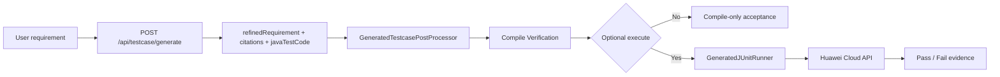

# Testcase Generation Batch 3 (Current Version Design, V3)

Status: **Execution design** (current version, implementable constraints)

This document is the *current* Batch 3 design baseline for: **testcase requirement (+ optional referenceUrl) -> Java testcase code**.
It is intentionally constrained and must not drift into "收编" (planner/workflow/orchestrator or auto-execution).

Current rule authority:
- This document is the execution baseline for Batch 3.
- Product hard decisions are recorded in `meeting.md` (latest Batch 3 entries).
- `docs/DESIGN.md` and `docs/ARCHITECTURE.md` remain target-state documents; they must not override this file for current implementation truth.

## 1. Background And Goal

Batch 3 goal:
- Input: a natural language testcase requirement (free text).
- Optional input: a `referenceUrl` (a web page that contains relevant API docs).
- Output: **Java testcase code** (a single-file Java test class as a string).

Key rules:
- KB hit: do **RAG** then use **custom LLM from configuration** to generate Java test code.
- KB miss + `referenceUrl` present: fetch/crawl the URL, extract temporary context, then use the **same custom LLM** to generate code.
- KB miss + `referenceUrl` absent: return error, **do not generate code**.

## 2. Non-Goals (Hard)

- No planner/workflow/orchestrator and no multi-step execution framework.
- No auto-running tests.
- No service-side automatic execution against Huawei Cloud during `POST /api/testcase/generate`.
- No writing files to the repo (no `src/test/java/**` writes from the service).
- No PR creation.
- No new storage or middleware as a prerequisite.
- No new external API routes besides `POST /api/testcase/generate`.

## 3. User Entry And API Contract

Endpoint:
- `POST /api/testcase/generate`

Request JSON:
```json
{
  "requirement": "Validate delete workflow returns 400 for invalid workflow_id",
  "referenceUrl": "https://support.huaweicloud.com/api-modelarts/modelarts_03_0002.html",
  "expectedHttpStatus": 400,
  "expectedErrorCode": "ModelArts.0104",
  "expectedErrorDescription": "Invalid parameter, error: Key: '' Error:Field validation for '' failed on the 'uuid4' tag."
}
```

Response JSON (HTTP 200):
```json
{
  "javaTestCode": "/* full Java test code */",
  "degraded": false,
  "citations": [
    {
      "type": "knowledge-base",
      "apiId": "huawei-modelarts-listWorkflows",
      "source": "https://support.huaweicloud.com/api-modelarts/ListWorkflows.html"
    },
    {
      "type": "reference-url",
      "source": "https://support.huaweicloud.com/api-modelarts/modelarts_03_0002.html"
    }
  ]
}
```

Notes:
- `citations` is required for traceability (KB RAG sources and/or referenceUrl).
- "KB hit" is defined as: at least one retrieved item can be resolved to a concrete API metadata record (e.g. `apiId` exists and metadata lookup succeeds). A vector store returning text segments alone is not a KB hit.
- `degraded` semantics:
  - `false`: generation used normal KB hit RAG context as primary source.
  - `true`: generation succeeded but used fallback/partial context (for example KB miss + referenceUrl temporary context).
- Optional expectation fields are part of the current request contract:
  - `expectedHttpStatus`
  - `expectedErrorCode`
  - `expectedErrorDescription`
- Real validated truth for the negative case `DELETE /v2/{project_id}/workflows/invalid-id-format` is:
  - HTTP `400`
  - `error_code=ModelArts.0104`
  - `error_msg=Invalid parameter, error: Key: '' Error:Field validation for '' failed on the 'uuid4' tag.`

## 4. Generation Chain (Single Request, No Orchestration)

All LLM calls must use the **custom LLM** configured via `knowledge-base.llm.*`.

1. Requirement refinement (LLM call #1)
   - Input: `requirement` (+ optional short summary from `referenceUrl` if the URL is provided and fetch succeeds).
   - Output: a structured, generation-friendly testcase description (stable schema, strict format).
   - Purpose: make retrieval query stable and make code generation deterministic.

2. Context acquisition (retrieval)
   - Query KB using the refined description.
   - If KB hit:
     - Build RAG context from top matches (API metadata + source links).
   - If KB miss and `referenceUrl` is present:
     - Fetch/crawl and extract content from `referenceUrl` as **temporary** context for this request.
     - Do not persist it as a new prerequisite (no new storage).
   - If KB miss and `referenceUrl` is absent:
     - Return the hard error `TESTCASE_REFERENCE_URL_REQUIRED` (no generation).

3. Java testcase code generation (LLM call #2)
   - Input: refined testcase description + context (KB RAG context or referenceUrl extracted content).
   - Output: a compilable Java testcase class (JUnit 5 baseline).
   - Guardrails:
     - Do not output placeholders like `TODO` or "skeleton only" when context is insufficient.
     - If neither KB context nor referenceUrl context exists, must error (Step 2 rule).

## 4.1 Post-Generation Verification Chain (Repository Validation Path)

The service returns `javaTestCode`; repository-side scripts validate or execute that code. This verification chain is part of the current delivery baseline, but it is **not** a public service-side execution feature.



Current repository entrypoints:
- Compile-only verifier:
  - `bash scripts/verify_testcase_generation.sh ...`
- Runner preparation:
  - `bash scripts/install_generated_test_runner.sh`
- Generate + compile + optional real execute:
  - `bash scripts/run_generated_testcase.sh ...`

Rules:
- Compile-only is the default verification path and should be used as the fast gate.
- Real execute is an optional validation path for curated scenarios with explicit runtime config.
- Real execute validates generated code quality and environment truth; it is not part of the service request itself.

## 4.2 Generated Code Contract

The generated `javaTestCode` is not free-form text. It must follow these hard rules:

- Must contain exactly one `public class`.
- Must be JUnit 5 style code and compile with Java 21.
- Runtime config must be read via `requiredConfig(envKey, propertyKey)`; do not hardcode auth or project settings.
- At minimum, the following runtime values must be sourced from env vars or system properties when used by the testcase:
  - `HUAWEICLOUD_AUTH_TOKEN` / `hwcloud.auth.token`
  - `HUAWEICLOUD_PROJECT_ID` / `hwcloud.project.id`
  - `HUAWEICLOUD_BASE_URL` / `hwcloud.base.url`
- Resource identifiers must not be hardcoded. When the testcase uses API path parameters such as dev-server ID, instance ID, volume ID, or disk ID, they must be read from runtime config, for example:
  - `HUAWEICLOUD_DEV_SERVER_ID` / `hwcloud.dev-server.id`
  - `HUAWEICLOUD_INSTANCE_ID` / `hwcloud.instance.id`
  - `HUAWEICLOUD_VOLUME_ID` / `hwcloud.volume.id`
  - `HUAWEICLOUD_DISK_ID` / `hwcloud.disk.id`
- Generated code may only call the API that is supported by the selected citation/context. It must not silently introduce an extra API that is not present in the citation set.
- If explicit truth is not supplied through `expectedHttpStatus`, `expectedErrorCode`, or `expectedErrorDescription`, and the retrieved context also does not provide a concrete truth, the generated code must not fabricate exact status codes, error codes, error descriptions, state transitions, or field values.
- Generated code must not contain `TODO`, placeholder tokens, or fake sample IDs such as `lite-123`, `system`, `replace_with_xxx`, or similar fabricated literals for required resource IDs.

## 5. Error Semantics

Transport/framework errors:
- Invalid JSON/body types: `400/415` with structured JSON error payload.

Domain errors (hard rules):
- KB miss + no `referenceUrl`: HTTP `400` with:
  - `error.code=TESTCASE_REFERENCE_URL_REQUIRED`
  - `error.message` must instruct the user to provide `referenceUrl`
  - Response must not contain `javaTestCode`
  - Response must not contain `degraded`

Suggested error payload shape:
```json
{
  "error": {
    "code": "TESTCASE_REFERENCE_URL_REQUIRED",
    "message": "No related API found in knowledge base. Please provide referenceUrl to generate Java testcase code.",
    "timestamp": "2026-03-24T10:00:00+08:00"
  }
}
```

Degrade rules (allowed, but must remain safe):
- Reference URL fetch failure: may fall back to KB-only generation *only if* KB hit exists; otherwise it must still error (no code).
- KB retrieval failure should fail closed: do not generate code without a valid context source.
- Code generation should also fail closed on semantics: if the system cannot derive a truthful status/error assertion from explicit expectations or context, it must prefer a weaker assertion or fail the request rather than invent a false truth.

## 6. Configuration Dependencies (Custom LLM)

Both "requirement refinement" and "code generation" must call the same configurable custom LLM channel:
- `knowledge-base.llm.provider=custom`
- `knowledge-base.llm.api-url`
- `knowledge-base.llm.api-key`
- `knowledge-base.llm.model`
- Optional: `knowledge-base.llm.temperature`, `knowledge-base.llm.max-tokens`, `knowledge-base.llm.timeout-seconds`

Retrieval dependencies (existing KB stack):
- `knowledge-base.embedding.*`
- `knowledge-base.vector-store.*`

Batch 3 must not introduce a new config tree unless explicitly approved by P10.

Current runtime truth for the Lite Server BMS detach-volume negative case:
- Real API:
  - `DELETE /v1/{project_id}/dev-servers/{id}/detachvolume/{volume_id}`
- Real request target:
  - `project_id=2b5cf022801c4a1cac8ee90d431a8f20`
  - `id=f13a67fc-11c4-48f9-8f0f-b533a5bcea13`
  - `volume_id=0ce45186-07a7-4139-98b9-2a00233b5ba5`
- Real response:
  - HTTP `400`
  - `error_code=ModelArts.7000`
  - `error_msg=Server f13a67fc-11c4-48f9-8f0f-b533a5bcea13 type is BMS, does not support detach volume device.`

## 6.1 Real Execution Validation Contract

Real execution is allowed only as a repository-side verification path. It requires explicit runtime inputs and must remain opt-in.

Required runtime config for the current Huawei Cloud negative case:
- `HUAWEICLOUD_BASE_URL`
- `HUAWEICLOUD_AUTH_TOKEN`
- `HUAWEICLOUD_PROJECT_ID`
- `HUAWEICLOUD_DEV_SERVER_ID`
- `HUAWEICLOUD_VOLUME_ID`

Execution boundaries:
- The service does not store or manage cloud credentials for the user.
- Execute mode must use the same generated `javaTestCode` returned by `/api/testcase/generate`; it must not rewrite the business assertions by hand.
- Execute mode is used to verify “generated code can really run”, not to replace the service with a workflow engine.

## 7. Acceptance Criteria (Batch 3)

- `POST /api/testcase/generate` returns Java testcase code when:
  - KB hit exists, regardless of `referenceUrl`.
  - KB miss but `referenceUrl` is provided and fetch succeeds (uses temporary context).
- Success response must include all three fields: `javaTestCode`, `citations`, `degraded`.
- `degraded=false` when KB hit context drives generation.
- `degraded=true` when generation is completed via fallback/partial context path.
- The endpoint returns an error and generates **no code** when:
  - KB miss and `referenceUrl` is absent.
- All generation steps use the configured custom LLM (no hardcoded vendor/model in code path).
- No new external API routes besides `/api/testcase/generate`.
- No new storage/middleware introduced.
- No workflow/planner/executor/orchestrator path introduced.
- Response includes `citations` for provenance.
- Generated code contains exactly one `public class`.
- Generated code compiles with Java 21 and JUnit 5 dependencies.
- Generated code does not contain `TODO` or placeholder tokens.
- Generated code does not hardcode required resource IDs such as dev-server ID, instance ID, volume ID, or disk ID.
- Generated code uses only the cited API context and does not silently add extra API calls.
- When explicit truth is absent, generated code does not fabricate exact status/error assertions.
- Repository verification entrypoints remain aligned with this contract:
  - `scripts/verify_testcase_generation.sh`
  - `scripts/install_generated_test_runner.sh`
  - `scripts/run_generated_testcase.sh`

## 8. Implemented vs Not Implemented (Current Batch 3 Truth)

Implemented:
- `POST /api/testcase/generate`
- Requirement refinement -> retrieval -> code generation main path
- Knowledge-base hit path and referenceUrl fallback path
- Generated code post-processing and compile-oriented contract checks
- Compile-only verification script
- Optional real execution validation script

Not implemented:
- Any service-side auto execution after generation
- Planner/workflow/orchestrator style task decomposition
- Service-side file writing into repository test sources
- Frontend product UI
- Productionized multi-scenario batch validation framework

## 9. Relationship With Historical Docs

The following docs are **goal design / larger scope** and must not be treated as Batch 3 execution baseline:
- `docs/DESIGN.md`
- `docs/API_TEST_GENERATOR.md`
- `docs/USE_CASE_OPTIMIZER.md`

Batch 3 execution hard rules:
- This file + `meeting.md` latest Batch 3 decisions are the current baseline.
