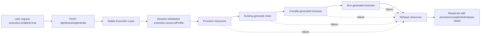

# Testcase Generation Batch 3 (Current Version Design, V3)

Status: **Execution baseline + approved execute-mode extension**

This document is the current Batch 3 contract for `POST /api/testcase/generate`.
Current truth today: the shipped baseline is still **generate-only**. This revision also records the approved execute extension on the **same endpoint**. The trigger contract is `execution.enabled=true` together with `execution.resourceProfile`; do not keep a parallel flat trigger reading.

Current rule authority:
- This document is the Batch 3 execution baseline and approved incremental design.
- Product hard decisions are recorded in `meeting.md` (latest Batch 3 entries).
- `docs/DESIGN.md` and `docs/ARCHITECTURE.md` remain target-state documents; they must not override this file for current implementation truth.

## 1. Scope And Baseline

Batch 3 currently supports:
- Input: a natural language testcase requirement (free text).
- Optional input: a `referenceUrl` (a web page that contains relevant API docs).
- Output in default mode: **Java testcase code** (a single-file Java test class as a string).

This round adds the approved execute-mode contract:
- Public endpoint remains `POST /api/testcase/generate`.
- If `execution` is absent, or `execution.enabled` is not `true`, the request remains on the existing generate-only path.
- Execute capability is enabled on the same route through nested `execution.enabled=true`.
- In `execute` mode, resource lifecycle is owned by a service-side stable execution layer, not by LLM-generated code.

Key generation rules:
- KB hit: do **RAG** then use the configured custom LLM to generate Java test code.
- KB miss + `referenceUrl` present: fetch/crawl the URL, extract temporary context, then use the same custom LLM to generate code.
- KB miss + `referenceUrl` absent: return error, **do not generate code**.

## 2. Hard Boundaries

- No second public execute route besides `POST /api/testcase/generate`.
- No planner/workflow/orchestrator and no generic multi-step execution framework.
- No generic resource orchestration platform.
- No user-defined free-form resource graph or arbitrary provisioning script.
- No writing files to the repo (no `src/test/java/**` writes from the service).
- No PR creation.
- No new storage or middleware as a prerequisite.
- `execute` first version supports only a server-side whitelist of `execution.resourceProfile`.
- LLM-generated testcase code is limited to API invocation, request construction, and assertions.
- Resource provision/release, runtime wiring, and cleanup belong to the stable execution layer.

## 3. Public API Contract

Shared endpoint:
- `POST /api/testcase/generate`

Shared request fields:
- `requirement`
- `referenceUrl` (optional)
- `expectedHttpStatus` (optional)
- `expectedErrorCode` (optional)
- `expectedErrorDescription` (optional)
- `execution` (optional object)

Execute-only request field:
- `execution.enabled`: must be `true` to enter execute path
- `execution.resourceProfile`: required when `execution.enabled=true`; must be a service-side whitelist ID

### 3.1 Generate Request / Response

Generate request example:
```json
{
  "requirement": "Validate delete workflow returns 400 for invalid workflow_id",
  "referenceUrl": "https://support.huaweicloud.com/api-modelarts/modelarts_03_0002.html",
  "expectedHttpStatus": 400,
  "expectedErrorCode": "ModelArts.0104",
  "expectedErrorDescription": "Invalid parameter, error: Key: '' Error:Field validation for '' failed on the 'uuid4' tag."
}
```

Generate response example:
```json
{
  "javaTestCode": "/* full Java test code */",
  "degraded": false,
  "refinedRequirement": "前置条件：...\n输入：...\n步骤：...\n断言：...",
  "citations": [
    {
      "type": "knowledge-base",
      "apiId": "huawei-modelarts-listWorkflows",
      "source": "https://support.huaweicloud.com/api-modelarts/ListWorkflows.html"
    },
    {
      "type": "reference-url",
      "source": "https://support.huaweicloud.com/api-modelarts/modelarts_03_0002.html"
    }
  ]
}
```

### 3.2 Execute Request / Response

Execute request example:
```json
{
  "requirement": "验证卸载 Lite Server 系统盘在 BMS 场景下返回 400",
  "expectedHttpStatus": 400,
  "expectedErrorCode": "ModelArts.7000",
  "expectedErrorDescription": "does not support detach volume device",
  "execution": {
    "enabled": true,
    "resourceProfile": "liteServerDetachVolumeNegativeV1"
  }
}
```

Execute response example:
```json
{
  "javaTestCode": "/* full Java test code */",
  "degraded": false,
  "refinedRequirement": "前置条件：...\n输入：...\n步骤：...\n断言：...",
  "citations": [
    {
      "type": "knowledge-base",
      "apiId": "huawei-modelarts-detachDevServerVolume",
      "source": "https://support.huaweicloud.com/api-modelarts/DetachDevServerVolume.html"
    }
  ],
  "execution": {
    "enabled": true,
    "resourceProfile": "liteServerDetachVolumeNegativeV1",
    "overallStatus": "FAILED",
    "stages": {
      "provision": "SUCCEEDED",
      "compile": "SUCCEEDED",
      "test": "FAILED",
      "release": "SUCCEEDED"
    }
  }
}
```

Notes:
- `citations` is required for traceability (KB RAG sources and/or `referenceUrl`).
- "KB hit" means at least one retrieved item can be resolved to a concrete API metadata record (for example `apiId` exists and metadata lookup succeeds). A vector store returning text segments alone is not a KB hit.
- `degraded=false` means generation used normal KB hit RAG context as primary source.
- `degraded=true` means generation succeeded but used fallback or partial context (for example KB miss + temporary `referenceUrl` context).
- The `execution.resourceProfile` value above is illustrative. Actual supported profiles are controlled by a service-side whitelist.
- `execution.stages` must always expose `provision`, `compile`, `test`, and `release`.

## 4. Generate Mode Chain

All LLM calls must use the custom LLM configured via `knowledge-base.llm.*`.

1. Requirement refinement
   - Input: `requirement` (+ optional short summary from `referenceUrl` if fetch succeeds).
   - Output: a structured, generation-friendly testcase description.
   - Purpose: make retrieval query stable and make code generation deterministic.
2. Context acquisition
   - Query KB using the refined description.
   - If KB hit: build RAG context from top matches (API metadata + source links).
   - If KB miss and `referenceUrl` is present: fetch/crawl and extract temporary context for this request only.
   - If KB miss and `referenceUrl` is absent: return `TESTCASE_REFERENCE_URL_REQUIRED`.
3. Java testcase code generation
   - Input: refined testcase description + context (KB RAG context or extracted `referenceUrl` content).
   - Output: a compilable Java testcase class (JUnit 5 baseline).
   - Guardrails:
     - Do not output placeholders like `TODO` or "skeleton only".
     - If neither KB context nor `referenceUrl` context exists, must error.

## 5. Execute Mode Chain

`execution.enabled=true` reuses the same refinement, retrieval, and code-generation pipeline, then adds a stable service-side execution layer.



### 5.1 Stable Execution Layer Responsibility

- Resolve `execution.resourceProfile` to a fixed, audited server-side routine.
- Auto-provision only the resources required by that profile.
- Feed resolved runtime values into the generated testcase at execution time.
- Reuse the same generated `javaTestCode`; do not hand-rewrite assertions in execute mode.
- Compile and run the generated testcase in a temporary execution workspace.
- Always trigger release on the way out, including failure paths.

### 5.2 Resource Profile Model

- First version supports only whitelisted `execution.resourceProfile`.
- Each profile binds:
  - a fixed provision routine
  - fixed runtime key mapping into generated testcase config
  - a fixed release routine
- User input cannot provide arbitrary provisioning logic, cleanup steps, or execution DAGs.
- This is not a generic resource orchestration platform.

### 5.3 Execution Status Contract

- `provision`, `compile`, `test`, and `release` are mandatory visible stages.
- Stage status should be represented with stable values such as `NOT_STARTED`, `RUNNING`, `SUCCEEDED`, `FAILED`, or `SKIPPED`.
- `release` must be attempted even when `provision`, `compile`, or `test` fails.
- If the response can still be produced, stage failure must be returned as structured execution result rather than collapsed into an opaque error.

## 6. Generated Code Contract

The generated `javaTestCode` is not free-form text. It must follow these hard rules:

- Must contain exactly one `public class`.
- Must be JUnit 5 style code and compile with Java 21.
- Runtime config must be read via `requiredConfig(envKey, propertyKey)`; do not hardcode auth or project settings.
- At minimum, the following runtime values must be sourced from env vars or system properties when used by the testcase:
  - `HUAWEICLOUD_AUTH_TOKEN` / `hwcloud.auth.token`
  - `HUAWEICLOUD_PROJECT_ID` / `hwcloud.project.id`
  - `HUAWEICLOUD_BASE_URL` / `hwcloud.base.url`
- Resource identifiers must not be hardcoded. When the testcase uses API path parameters such as dev-server ID, instance ID, volume ID, or disk ID, they must be read from runtime config, for example:
  - `HUAWEICLOUD_DEV_SERVER_ID` / `hwcloud.dev-server.id`
  - `HUAWEICLOUD_INSTANCE_ID` / `hwcloud.instance.id`
  - `HUAWEICLOUD_VOLUME_ID` / `hwcloud.volume.id`
  - `HUAWEICLOUD_DISK_ID` / `hwcloud.disk.id`
- Generated code may only call the API that is supported by the selected citation/context. It must not silently introduce an extra API that is not present in the citation set.
- Generated code is responsible only for the target API call and assertions. It must not create resources, release resources, poll lifecycle transitions, or embed cleanup flows.
- If explicit truth is not supplied through `expectedHttpStatus`, `expectedErrorCode`, or `expectedErrorDescription`, and the retrieved context also does not provide a concrete truth, the generated code must not fabricate exact status codes, error codes, error descriptions, state transitions, or field values.
- Generated code must not contain `TODO`, placeholder tokens, or fake sample IDs such as `lite-123`, `system`, `replace_with_xxx`, or similar fabricated literals for required resource IDs.

## 7. Error And Status Semantics

Transport/framework errors:
- Invalid JSON/body types: `400/415` with structured JSON error payload.

Domain errors:
- KB miss + no `referenceUrl`: HTTP `400` with:
  - `error.code=TESTCASE_REFERENCE_URL_REQUIRED`
  - `error.message` must instruct the user to provide `referenceUrl`
  - Response must not contain `javaTestCode`
  - Response must not contain `degraded`
- `execution.enabled=true` without `execution.resourceProfile`: HTTP `400`
- `execution.enabled=true` with unsupported `execution.resourceProfile`: HTTP `400`

Suggested hard-error payload shape:
```json
{
  "error": {
    "code": "TESTCASE_REFERENCE_URL_REQUIRED",
    "message": "No related API found in knowledge base. Please provide referenceUrl to generate Java testcase code.",
    "timestamp": "2026-03-24T10:00:00+08:00"
  }
}
```

Degrade and execution rules:
- `referenceUrl` fetch failure may fall back to KB-only generation only if KB hit exists; otherwise it must still error.
- KB retrieval failure should fail closed: do not generate code without a valid context source.
- Code generation should fail closed on semantics: if the system cannot derive a truthful assertion, it must prefer a weaker assertion or fail the request rather than invent a false truth.
- If `execution` is absent, or `execution.enabled` is not `true`, the service must stay on generate-only semantics.
- In execute mode, accepted requests must preserve `provision / compile / test / release` stage visibility even when one stage fails.

## 8. Configuration Dependencies And Runtime Inputs

Both requirement refinement and code generation must call the same configurable custom LLM channel:
- `knowledge-base.llm.provider=custom`
- `knowledge-base.llm.api-url`
- `knowledge-base.llm.api-key`
- `knowledge-base.llm.model`
- Optional: `knowledge-base.llm.temperature`, `knowledge-base.llm.max-tokens`, `knowledge-base.llm.timeout-seconds`

Retrieval dependencies:
- `knowledge-base.embedding.*`
- `knowledge-base.vector-store.*`

Batch 3 must not introduce a new public orchestration config tree unless explicitly approved by P10. Execute mode may keep an internal whitelist registry for `execution.resourceProfile`, but not user-defined orchestration logic.

Current validated truth for the Lite Server BMS detach-volume negative case:
- Real API:
  - `DELETE /v1/{project_id}/dev-servers/{id}/detachvolume/{volume_id}`
- Real request target:
  - `project_id=2b5cf022801c4a1cac8ee90d431a8f20`
  - `id=f13a67fc-11c4-48f9-8f0f-b533a5bcea13`
  - `volume_id=0ce45186-07a7-4139-98b9-2a00233b5ba5`
- Real response:
  - HTTP `400`
  - `error_code=ModelArts.7000`
  - `error_msg=Server f13a67fc-11c4-48f9-8f0f-b533a5bcea13 type is BMS, does not support detach volume device.`

Repository-side historical validation inputs for this case:
- `HUAWEICLOUD_BASE_URL`
- `HUAWEICLOUD_AUTH_TOKEN`
- `HUAWEICLOUD_PROJECT_ID`
- `HUAWEICLOUD_DEV_SERVER_ID`
- `HUAWEICLOUD_VOLUME_ID`

## 9. Acceptance Criteria

- Missing `execution`, or `execution.enabled!=true`, must behave the same as current generate-only baseline.
- `POST /api/testcase/generate` returns Java testcase code when:
  - KB hit exists, regardless of `referenceUrl`
  - KB miss but `referenceUrl` is provided and fetch succeeds
- Success response in generate mode must include `javaTestCode`, `citations`, `degraded`, and `refinedRequirement`.
- `degraded=false` when KB hit context drives generation.
- `degraded=true` when generation is completed via fallback or partial context path.
- The endpoint returns an error and generates no code when KB miss and `referenceUrl` is absent.
- All generation steps use the configured custom LLM.
- No new external API routes besides `/api/testcase/generate`.
- No workflow/planner/executor/orchestrator platform is introduced.
- Execute mode uses only whitelisted `execution.resourceProfile`.
- Resource lifecycle is owned by the stable execution layer, not by generated code.
- Execute mode must expose `provision / compile / test / release` stage states and attempt release on failure.
- Generated code contains exactly one `public class`.
- Generated code compiles with Java 21 and JUnit 5 dependencies.
- Generated code does not contain `TODO` or placeholder tokens.
- Generated code does not hardcode required resource IDs such as dev-server ID, instance ID, volume ID, or disk ID.
- Generated code uses only the cited API context and does not silently add extra API calls.
- When explicit truth is absent, generated code does not fabricate exact status or error assertions.

## 10. Current Implementation Status

Implemented today:
- `POST /api/testcase/generate` generate-only baseline
- Requirement refinement -> retrieval -> code generation main path
- Knowledge-base hit path and `referenceUrl` fallback path
- Generated code post-processing and compile-oriented contract checks
- Repository compile-only verification script
- Repository local compile-and-run validation script using user-supplied runtime config

Approved for this round but not yet implemented in current code:
- `execution.enabled=true` on the same `/api/testcase/generate` route
- Service-side stable execution layer for auto provision -> compile/run -> release
- Whitelisted `execution.resourceProfile` registry
- Structured `provision / compile / test / release` execution status response

Not implemented / explicitly excluded:
- Any second public execute route
- Generic resource orchestration platform
- Planner/workflow/orchestrator style task decomposition
- Generated code owning resource lifecycle
- Service-side file writing into repository test sources
- Frontend product UI

## 11. Relationship With Historical Docs

The following docs are goal-design or larger-scope documents and must not be treated as the Batch 3 execution baseline:
- `docs/DESIGN.md`
- `docs/API_TEST_GENERATOR.md`
- `docs/USE_CASE_OPTIMIZER.md`

Batch 3 execution hard rules:
- This file + latest Batch 3 entries in `meeting.md` are the current baseline.
